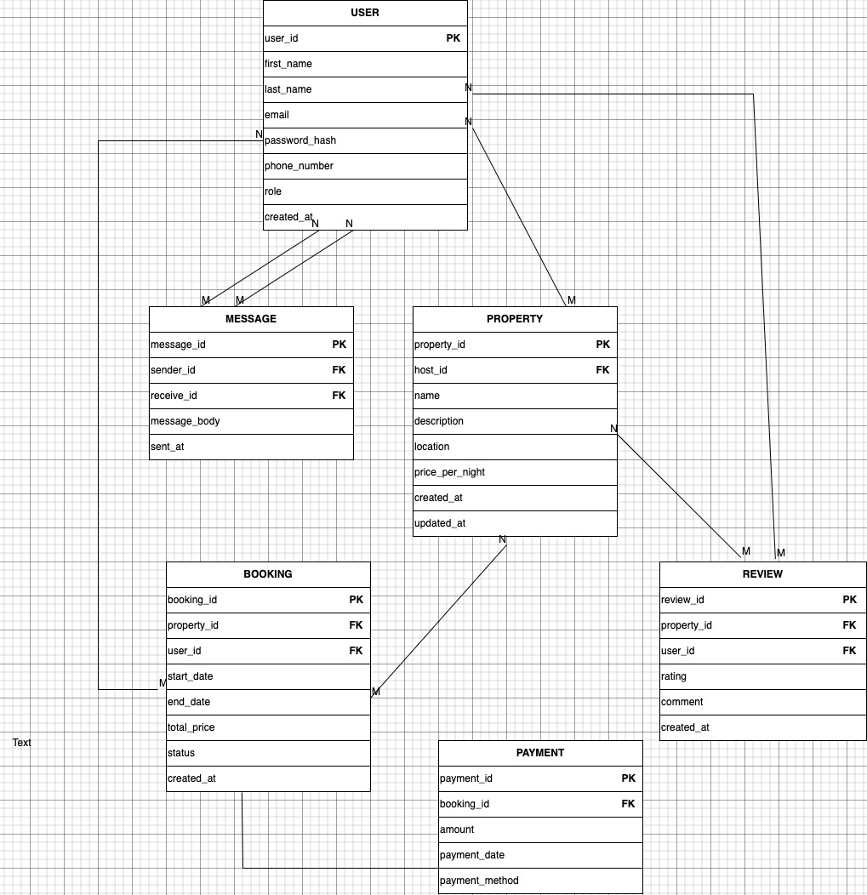

# DataScape: Mastering Database Design

### About the Project
This project is part of the comprehensive ALX Airbnb Database Module, focusing on database design, normalization, schema creation, and seeding. By working through these tasks, learners will design and build a robust relational database for an Airbnb-like application, ensuring scalability, efficiency, and real-world functionality. The project simulates a production-level database system, emphasizing high standards of design, development, and data handling.

---

### ER Diagram

---

### Data Flow
erDiagram
    USER {
        uuid user_id PK
        varchar first_name
        varchar last_name
        varchar email
        varchar password_hash
        varchar phone_number
        enum role
        timestamp created_at
    }
    
    PROPERTY {
        uuid property_id PK
        uuid host_id FK
        varchar name
        text description
        varchar location
        decimal price_per_night
        timestamp created_at
        timestamp updated_at
    }
    
    BOOKING {
        uuid booking_id PK
        uuid property_id FK
        uuid user_id FK
        date start_date
        date end_date
        decimal total_price
        enum status
        timestamp created_at
    }
    
    PAYMENT {
        uuid payment_id PK
        uuid booking_id FK
        decimal amount
        timestamp payment_date
        enum payment_method
    }
    
    REVIEW {
        uuid review_id PK
        uuid property_id FK
        uuid user_id FK
        integer rating
        text comment
        timestamp created_at
    }
    
    MESSAGE {
        uuid message_id PK
        uuid sender_id FK
        uuid recipient_id FK
        text message_body
        timestamp sent_at
    }
    
    - USER ||--o{ PROPERTY : "hosts"
    - USER ||--o{ BOOKING : "makes"
    - USER ||--o{ REVIEW : "writes"
    - USER ||--o{ MESSAGE : "sends"
    - USER ||--o{ MESSAGE : "receives"
    - PROPERTY ||--o{ BOOKING : "has"
    - PROPERTY ||--o{ REVIEW : "receives"
    - BOOKING ||--|| PAYMENT : "has"