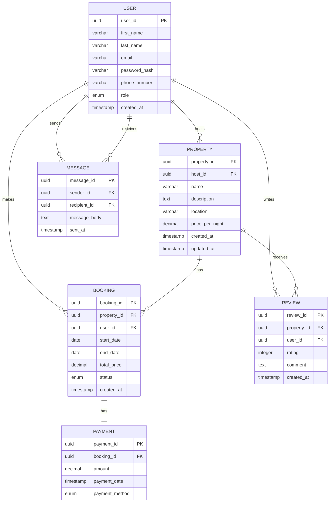

# ALX Airbnb Database Module


## About the Project

This project is part of the comprehensive **ALX Airbnb Database Module**, focusing on database design, normalization, schema creation, and seeding. By working through these tasks, learners will design and build a robust relational database for an Airbnb-like application, ensuring scalability, efficiency, and real-world functionality. The project simulates a production-level database system, emphasizing high standards of design, development, and data handling.

## Database Schema



## Learning Objectives

As a professional developer, completing these tasks will empower you to:

* Apply advanced principles of **database design** to model complex systems
* Master the art of **normalization** to optimize database efficiency and minimize redundancy
* Use **SQL DDL** to define database schema with appropriate constraints, keys, and indexing for performance optimization
* Write and execute **SQL DML** scripts to seed databases with realistic sample data, simulating real-world scenarios
* Enhance collaboration skills by managing repositories, documenting processes, and adhering to professional submission standards

## Requirements

To successfully complete these tasks, you must:

1. Have a strong foundation in **relational databases** and SQL
2. Be proficient in using **Draw.io** or similar tools for visual modeling
3. Possess a good understanding of **data normalization principles**, particularly up to 3NF
4. Have experience with GitHub repositories for documentation and project submission
5. Follow industry best practices for database design and scripting

## Project Tasks

### Task 1: Entity-Relationship Diagram (ERD)

Craft a detailed **Entity-Relationship Diagram (ERD)** to visualize the database design, ensuring clear relationships and properly defined entities.

**Deliverables:**
- Complete ERD with all entities, attributes, and relationships
- Visual representation using Draw.io or similar tool
- Documentation of design decisions

### Task 2: Database Normalization

Apply **normalization principles** to refine your database design, optimizing data integrity and minimizing redundancy.

**Deliverables:**
- Documentation of the normalization process
- Analysis of functional dependencies
- Evidence of 3NF compliance for all tables

### Task 3: Schema Creation

Create SQL scripts to define the database schema, incorporating primary keys, foreign keys, and indexes for optimal query performance.

**Deliverables:**
- SQL DDL scripts for all tables
- Properly defined constraints and relationships
- Optimized index creation for performance

### Task 4: Database Seeding

Populate the database with **real-world sample data**, simulating an Airbnb-like environment with users, properties, bookings, and payments.

**Deliverables:**
- SQL DML scripts with sample data
- Realistic data that respects all constraints
- Sufficient volume of data for testing queries

## Directory Structure

```
airbnb-database-module/
├── diagrams/
│   └── er-diagram.png
├── docs/
│   ├── normalization.md
│   └── design-decisions.md
├── sql/
│   ├── schema.sql
│   └── seed-data.sql
├── README.md
└── LICENSE
```

## Getting Started

1. Clone this repository
2. Review the project requirements and tasks
3. Start with Task 1 (ERD design) and progress through the tasks sequentially
4. Use the provided templates and examples as guidance
5. Submit your work according to the submission guidelines

## Tools and Resources

- **Database Design**: Draw.io, LucidChart, or similar ER diagram tools
- **SQL Development**: MySQL, PostgreSQL, or any relational database of your choice
- **Documentation**: Markdown for all documentation files
- **Version Control**: Git and GitHub for project management

## Submission Guidelines

1. Fork this repository
2. Complete all required tasks
3. Update the README with your specific implementation details
4. Ensure all code is properly commented and formatted
5. Submit a pull request with your completed work

## License

This project is licensed under the MIT License - see the LICENSE file for details.

## Acknowledgments

- ALX Software Engineering Program
- The Airbnb open-source community for inspiration
- All contributors to this educational project