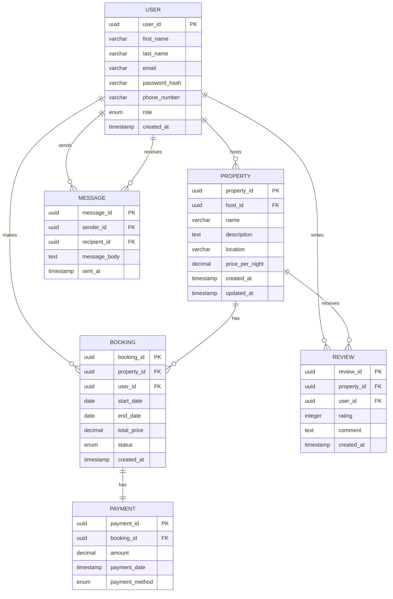

# AirBnB Database ER Diagram

## Mermaid ER Diagram Code

## Database Entities

### User
- Stores user information including authentication details
- Users can be guests, hosts, or admins
- Primary key: `user_id` (UUID)

### Property
- Represents rental properties listed on the platform
- Owned by a host (user with host role)
- Primary key: `property_id` (UUID)
- Foreign key: `host_id` references User

### Booking
- Records reservation information
- Links guests with properties for specific dates
- Primary key: `booking_id` (UUID)
- Foreign keys: `property_id` and `user_id`

### Payment
- Tracks payment information for bookings
- Primary key: `payment_id` (UUID)
- Foreign key: `booking_id` references Booking

### Review
- Stores user feedback about properties
- Primary key: `review_id` (UUID)
- Foreign keys: `property_id` and `user_id`

### Message
- Facilitates communication between users
- Primary key: `message_id` (UUID)
- Foreign keys: `sender_id` and `recipient_id` (both reference User)

## Relationships
- A user can host multiple properties
- A user can make multiple bookings
- A user can write multiple reviews
- A user can send and receive multiple messages
- A property can have multiple bookings
- A property can receive multiple reviews
- Each booking has exactly one payment
